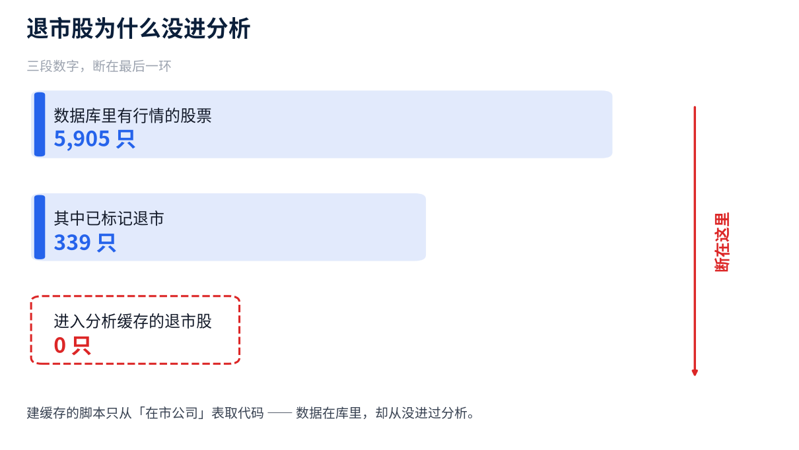
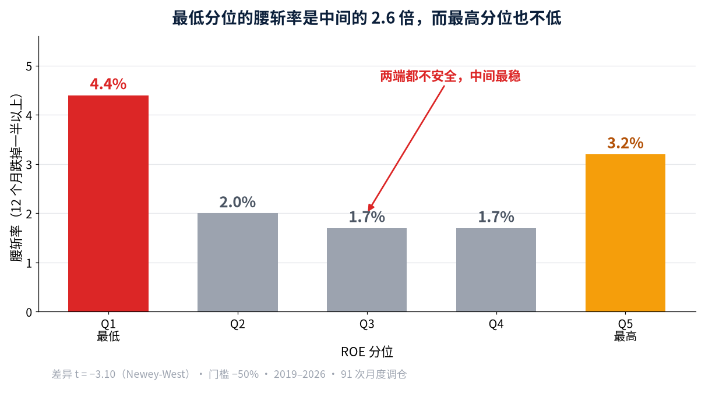
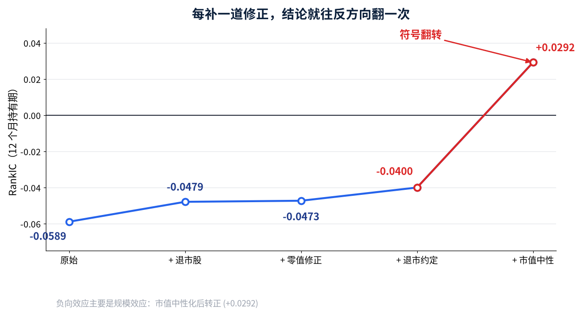

# IC看不见崩盘：ROE因子全身检查

> 一个 A 股 ROE 因子报出 RankIC −0.059，看着挺能用。可全身检查查出 3 个毛病：数据里一只退市股都没有、IC 看不见崩盘、负向效应其实是规模效应。补数据、写退市约定、加尾部统计、做事前冻结的样本外之后，RankIC 从 −0.059 走到 +0.029，真正稳的信号藏在崩盘率里。

## 一、看着挺显著的因子，第一步就翻车

我拿 A 股全部股票的 ROE 做月度调仓。算 2019 年至今的 RankIC。

最好的持有期是 12 个月，RankIC = **−0.059**。

这个数字不算小。IC 的绝对值过 0.05，在 A 股已经能进候选池。

但我先做了一件事：**给这份数据做全身检查**。

检查有 10 项：复权连续性、涨跌幅越界、覆盖率缺口、存活偏差。

第一项就翻车了。

**分析样本里 5,004 只股票，没有一只在区间中途消失。**

正常的全市场样本，每年都有一批公司退市。一只都没有，只有一种解释。

**这份面板里装的，全是活到今天的公司。**

我去查了源头。库里其实有 339 只退市股，还专门做过入库核实。问题出在分析缓存：建缓存的脚本只从「在市公司」那张表里取代码。

**数据在库里，却从来没进过分析。**

## 二、第一次翻案：补上退市股，信号反而弱了 20%

把 250 只退市股的行情与财务补进来。面板股票数从 5,066 只变成 5,316 只。

按常识，补上最差的公司，负向因子的信号应该更强。

实测相反：

| 持有期 | 补数据前 | 补数据后 |
|---|---|---|
| 12 个月 | −0.0589 | **−0.0479** |

**|RankIC| 弱了 20%。**

为什么？我把退市股的收益一条条拆开看，找到了答案。

退市股在消失之前，确实在跌。但我算的是「未来 12 个月收益」。

一只股票如果 5 个月后退市，它根本没有未来 12 个月。

**退市股最后 3 个调仓日，12 个月收益的实现率只有 14%。在市股是 86%。**

长持有期下，退市股最惨的那一段，被清洗规则丢掉了。

留下来的，反而是还没走到尽头的那些。

## 三、把「消失」写进规则

问题的根子不在数据，在规则。

原来的规则是：拿不到期末价格就当缺失，直接删。

我改成 3 条：

- **退市**：按最后成交价清算，之后视为现金，收益记 0。
- **窗口内停牌**：仍按缺失处理，不许拿停牌前的旧价充数。
- **两者分开判**：判据是「期末之后还有没有价格」。

第 2 条最容易被忽略。停牌 3 周和退市，在数据里长得一样，都是没有价格。

**但一个是流动性问题，一个是终点。**

口径修完，均值又弱了一点：−0.0473 掉到 **−0.0400**。

我还试过一个更保守的版本：在最后成交价上再打 30% 折扣。

结果几乎没变（−0.0400 对 −0.0395）。**说明信号不是极值驱动的**，这一点后面有用。

到这里，故事该结束了。它没有。

## 四、第二次翻案：IC 看不见崩盘

我不再只看均值，改看左尾：**这个因子能不能预测腰斩**。

门槛设成 −50%，也就是一年跌掉一半。各分位的命中率是这样：

| ROE 分位 | 腰斩率 |
|---|---|
| 最低（Q1） | **4.4%** |
| Q2 | 2.0% |
| Q3 | 1.7% |
| Q4 | 1.7% |
| 最高（Q5） | 3.2% |

最低分位是中间那几档的 2.6 倍。差异的 t 值是 **−3.10**。

**均值口径说「信号变弱了」，尾部口径说「低 ROE 更容易腰斩」。两个结论相反，而且同时成立。**

机制在这里。RankIC 用 Spearman 秩相关，它度量的是**全样本的成对单调性**。

新补进来的退市股，几乎全挤在「ROE 最低 + 收益最差」那个角上。

它们彼此之间是同序对，会把相关系数往正方向拉。

**所以秩相关对「灾难性下行」有结构性盲区。一堆挤在双低角的样本，反而会把 IC 拉高。**

还有个细节：最高的那一档（Q5）是 3.2%，也高于中间。

**两端都不安全，中间最稳。** 这种非单调的形状，均值差和秩相关在原理上都表达不了。

有人会说：4.4% 和 1.7% 只差 2.7 个百分点，够看吗？

够不够不看差值大小，看它稳不稳。这要靠样本外，第 6 节说。

## 五、第三次翻案：负向因子其实是规模效应

还有一层没查：低 ROE 的股票，会不会同时是小市值？

小市值长期有超额收益，ROE 又偏低。两者一混，ROE 就会「看起来」是负向因子。

我把市值这个维度剥掉，再做一遍：

**RankIC 从 −0.027 翻成 +0.038。符号反了。**

再加上行业中性化，仍然是 **+0.029**。

**原来的「ROE 是负向因子」，主要是规模效应。**

而崩盘那一侧的结论，越控越强：

| 口径 | 腰斩率差异 t 值（12 个月） |
|---|---|
| 原始 | −3.10 |
| 市值中性 | −7.97 |
| 行业 + 市值中性 | **−8.28** |

**不是市值效应，也不是行业效应。控制完两层之后，它反而更清晰。**

## 六、最后一道闸：事前冻结的样本外

到这一步，我已经试过很多规格：持有期 4 个、退市约定 3 种、门槛 2 种。

**试得越多，「找到规律」就越可能只是运气。** 这是多重检验问题。

我做了两件事。

第一，把试过的每个假设**记进台账**。4 个持有期，就是 4 个假设。

这件事不能靠记性。研究者最常见的失误不是造假，是**忘了自己试过多少个组合**。

所以我把记账写成了代码：每跑一次假设检验就记一笔，校正时自动数出来。这套流程有开源实现，附录里说。

第二，用台账算显著门槛：Bonferroni 校正下，**|t| 要超过 2.498 才算数**，不是 1.96。

然后把规格冻结，拿后半段数据只验一次。

- **训练段 2019—2022**：4 个持有期全试，6 个月最强，t = −4.89
- **冻结**：持有期 6 个月、门槛 −50%、方向「低 ROE 腰斩更多」
- **测试段 2023—2026**：只算这 1 个假设

测试段结果：Q1 腰斩率 **2.00%**，Q5 是 **0.28%**，相差 **7.1 倍**。t = **−3.32**。

**−3.32 的绝对值过了 2.498 的门槛，通过。**

顺带说，12 个月那一档没通过。它在训练段 t 只有 −0.69，全样本那个 −3.10 是后半段撑起来的。

**能站住的是 3 个月和 6 个月。**

## 七、所以 ROE 到底是什么

把所有修正做完，ROE 的最终画像是这样：

- **对收益**：市值中性后是**正向弱因子**（+0.029）。原先的负向，是规模效应。
- **对崩盘**：是**显著的风险因子**。最低分位腰斩率 4.4%，中间只有 1.7%。

它更像一个风险指标，不是一个收益指标。剔除低 ROE 不带来超额收益，但能明显降低腰斩暴露。

这次全身检查留下 3 条方法论：

- **补数据不等于修好偏差。** 长持有期收益在退市处是结构性缺失的。不写显式约定，IC 会一直看着一个残缺样本。
- **均值、秩相关、尾部是 3 种提问方式。** 它们可以给出相反答案，而且同时正确。只看 IC，会漏掉整个下行维度。
- **方向可以先猜，但以实测为准。** 这一轮我猜了 2 次方向，2 次都被推翻。

## 附：这套流程有开源实现

上面这套东西，我整理成了一个开源库：**alphalens-cna**。

它包含数据体检、带原因的清洗、退市收益约定、尾部统计、多重检验台账。定位是中国 A 股的 alphalens 替代品。

两个可以直接验的技术点：

- 退化配置下，它与 alphalens 的 3 个核心量（IC、分层均值、换手）**逐位相同，最大差 0.000e+00**。
- 而 alphalens 在真实 A 股月频下**清洗阶段就抛异常**，根本跑不起来。

- GitHub：https://github.com/yinxiuqu/alphalens-cna
- 许可证：Apache-2.0，`pip install` 可用

---

数据都在，代码也都在，结论可以自己复算。如果你也遇到过「补了数据反而更不显著」这种事，欢迎留言聊聊。

觉得有用？点个关注，持续获取优质金融量化分析。
