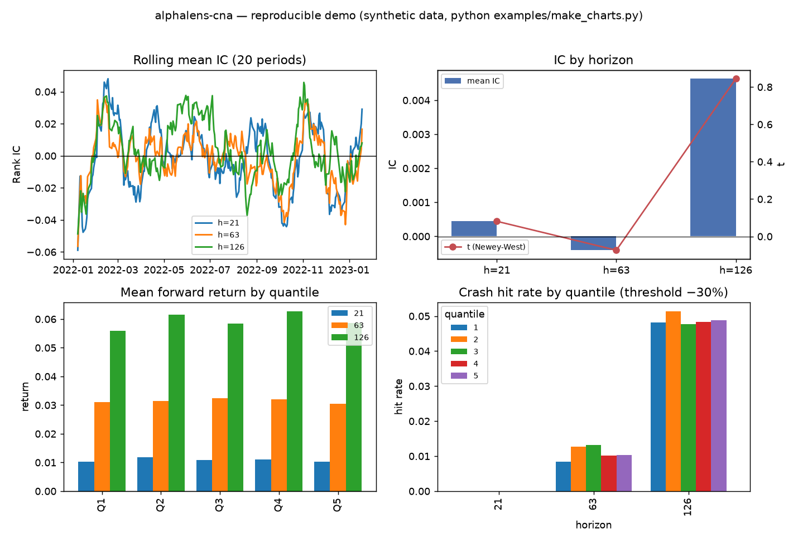

# alphalens-cna

**中国 A 股的因子研究工具链** —— alphalens 的替代品。

它不只算 IC，还要回答 **"这个 IC 可不可信"**。

```
pip install alphalens-cna            # 依赖只有 numpy / pandas / scipy
```

---

## 为什么不用 alphalens

实测（同一份真实 A 股月频面板）：

| 缺陷 | 实测表现 |
|---|---|
| **D9 非规则频率崩** | `get_clean_factor_and_forward_returns` 在**清洗阶段就抛 ValueError**（`utils.py:358` 硬写 `index.levels[0].freq`）。真实 A 股月频（每月最后一个交易日，`freq is None`）**根本跑不起来** |
| **D2 月频面板标成 `1D`** | 列名与实际持有期不符 |
| **D5 无脑 `dropna`** | 丢了什么、为什么丢，一概不知 |
| **D6 没有 A 股成交规则** | 一字涨停买不进、停牌、ST 5%、T+1 全都不管 |
| **D7 存活偏差** | 面板里只有活到今天的公司 |
| **D10 零推断** | 直接给你 IC 和 t，不问重叠观测、不问一共测了多少个假设、不问尾部风险 |
| **D3 `import` 拉起 matplotlib** | 只想算个数，却装了半个绘图栈 |

## 六道防线

| # | 防线 | 落点 | 失败表现 |
|---|---|---|---|
| 1 | 契约校验 | `contract/` | **拒绝运行**，不产出数字 |
| 2 | 数据体检 | `health.check()` | 10 项体检，超阈值告警 + 明细 |
| 3 | 不变量对账 | `CleanResult.ledger` | 输入 = 输出 + 各类剔除，**对不上就抛异常** |
| 4 | **等价性回归** | `compat.check_parity()` | 退化配置下与 alphalens **逐位相同（0.000e+00）** |
| 5 | 已知答案测试 | `tests/`（301 个） | 每处逻辑都有能手算的数据集 |
| 6 | 稳健性报告 | `inference/{robustness,rank_entropy}` | 扰动分布 + 排名熵，**不给单一数字** |

## 长什么样



> 上图由 `python examples/make_charts.py` 生成，**数据是合成的** ——
> clone 下来就能自己重跑。用私有数据出的图表放在 `docs/cases/`，
> 那里明确标注了**不可复现**：本库的卖点是"证据可复现"，
> 读者只能看不能验的图，不该拿来当门面。

## 三分钟上手

```python
import alphalens_cna as acna

# 1) 一行式：体检 → 成交规则 → 清洗 → 分层 → IC → 推断 → 报告
rep = acna.build_report(factor, prices, calendar,
                        horizons=(21, 63, 126, 252),
                        n_trials=4,              # 你一共测过几个假设
                        crash_threshold=-0.5)    # 崩盘=一年腰斩
print(rep.verdict)          # 结论 + 尾部风险，都带不确定性
open('report.md', 'w').write(rep.to_markdown())
```

报告九节：结论 / **数据体检** / 样本账 / IC / Newey-West / 分层 / **尾部风险** / 换手 / 剔除明细。

### 想知道"数据能不能用"

```python
h = acna.health_check(prices=px, factor=f, tradability=t, calendar=cal)
print(h)                    # 10 项：复权连续性 / 存活偏差 / 覆盖率 / OHLC / 因子冻结 …
print(h.warnings)           # 直接塞进报告头部
```

它抓到过的真问题：某分析缓存里 **0/339 只退市股**（数据在库里，却从没进过分析）；
PIT 财务表里 **705 只股票**的 `roe = 0` 占位被当成真值。

### 想知道"结论靠不靠少数样本"

```python
acna.pfs(ic_series)                       # 扰动鲁棒性 [0,1]
acna.robustness_report(ic_series)         # 多组扰动并列
acna.rank_stability(factor)               # RRE：排名结构稳定性
acna.tail_by_quantile(clean, threshold=-.5)   # 崩盘率 / CVaR
```

**为什么需要尾部统计**：实测同一份数据里，把退市股放回样本后
RankIC 反而**变弱**（−0.059 → −0.040），但最低分位的**腰斩率**从 3.2% 跳到 4.3%、
差异 t = −3.10。**秩相关看不见"联合极值簇"** —— 只看 IC 会漏掉整个灾难性下行维度。

### 不想凭记忆填 `n_trials`

```python
led = acna.ResearchLedger('roe_study.jsonl')
led.record(goal='roe', factor='roe', horizon=21, t=-1.42)   # 每测一次记一笔
acna.assess(ic=ic, n_trials=led.n_trials('roe'))            # 自动数，不是猜
led.check_n_trials(claimed=3, goal='roe')                   # 抓"低报校正基数"
```

## 输入格式

核心包**不认识任何具体数据源**，只认契约对象；字段、单位、目录约定见
[`docs/输入数据规格.md`](docs/输入数据规格.md)。一句话：三价并存 —

* `raw_*` 原始不复权价 —— **只用于制度判定**（涨跌停 / ST / 报价单位）
* `adj_factor` 复权因子 —— 唯一真相
* `adj_*` 复权价 —— **只用于收益计算**

私有数据源（mongo、内部 parquet）的适配器放在 `examples/`，**不进核心包**。

## 设计原则

1. **推断与计算分离** —— `analysis/` 只算，`inference/` 才判断
2. **契约强制执行** —— 前视、复权口径这类错误是硬拒绝，不是文档提醒
3. **每一步剔除都可归因** —— 带原因的账，不许无脑 `dropna`
4. **不给单一数字** —— 估计量自带有效样本量与不确定性
5. **不夸大显著性** —— 重叠观测修正、多重检验校正、NW 方差下限（`vif ≥ 1`）
6. **发现的偏差自己先报** —— 这个库的开发过程里修正过三次自己的结论

## 状态

M0 / M1 完成，M2 进行中。

| 层 | 模块 |
|---|---|
| L0 契约 | `contract/`（8 个对象 + 自维护交易日历，不依赖 pandas freq） |
| 适配 | `adapters/input/`（dataframe / parquet） |
| L1 体检 | `health/`（10 项） |
| L2 引擎 | `engine/`（复权 / 可成交性 / 收益 / 带原因清洗） |
| L3 预处理 | `preprocess/`（去极值 / 标准化 / 中性化 / 正交化 / 合成） |
| L4 分析 | `analysis/`（IC / 分层 / 换手 / 截面回归 / Fama-MacBeth / 事件研究 / 尾部） |
| L5 推断 | `inference/`（Newey-West / 多重检验 / 有效样本量 / 排序熵 / 扰动鲁棒性） |
| 台账 | `ledger/`（n_trials 自动记账） |
| 报告 | `report/`（tidy 表 + Markdown，**零绘图依赖**） |
| 对拍 | `compat/`（与 alphalens 逐位对拍） |

## 许可证

Apache License 2.0 —— 见 [LICENSE](LICENSE)。
